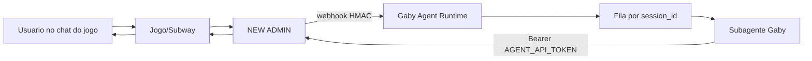

# Gaby Agent Runtime

Servico HTTP independente para conectar o chat do jogo ao subagente Gaby, atendente oficial Brasil Games.

Ele nao depende do Telegram e nao muda o bot Animus. O gestor envia webhooks para este runtime, o runtime processa em fila, aplica os fluxos da Gaby Brasil Games, chama a API `/api/agent/v1` do NEW ADMIN e escreve a resposta no chat.

## Fluxo



## Endpoints

- `GET /health` verifica se o runtime esta vivo.
- `POST /webhooks/subway` recebe eventos do gestor.
- `GET /runs/:runId` consulta status local de uma execucao.

## Setup

1. Copie `.env.example` para `.env`.
2. Configure:
   - `GABY_AGENT_API_TOKEN`: token do NEW ADMIN.
   - `GABY_WEBHOOK_SECRET`: secret HMAC configurado no painel.
   - `GABY_ADMIN_BASE_URL`: base URL do gestor.
3. Instale e rode:

```bash
cd apps/gaby-agent-runtime
bun install
bun run start
```

No painel do NEW ADMIN, configure a URL:

```text
https://seu-dominio/webhooks/subway
```

## Escala

O MVP usa fila em memoria com trava por `session_id`. Isso permite varias conversas em paralelo e preserva ordem dentro da mesma sessao.

Para producao com mais de uma replica, trocar a fila em memoria por Redis/BullMQ ou RabbitMQ. A API foi separada para essa troca ficar pequena.

## Regras de seguranca

- Nunca logar `GABY_AGENT_API_TOKEN`, payload Pix, CPF completo ou secrets.
- Validar HMAC antes de processar webhook.
- Responder webhook rapido e processar depois.
- Acoes financeiras manuais devem ter regra explicita e auditoria.
- Nunca prometer ganho, prazo exato, ou encaminhar para suporte humano no texto.
- Toda resposta ao usuario deve ser gravada pelo endpoint oficial de mensagens.
